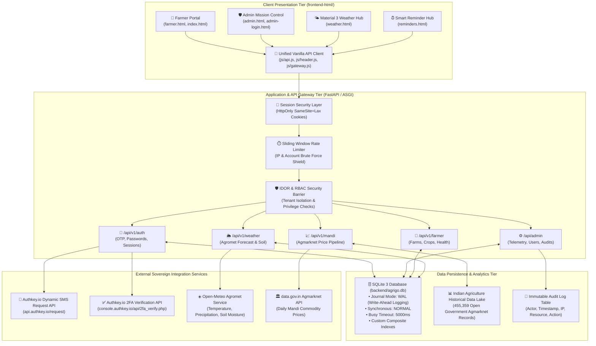
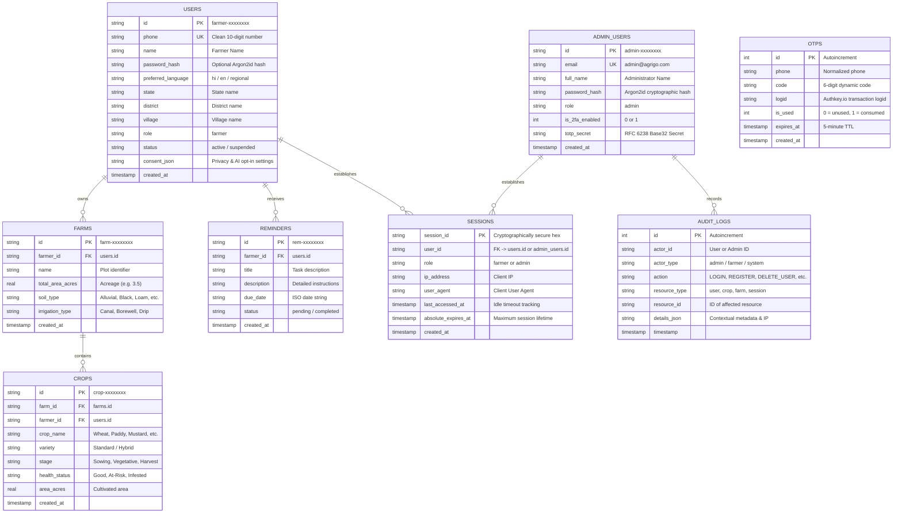
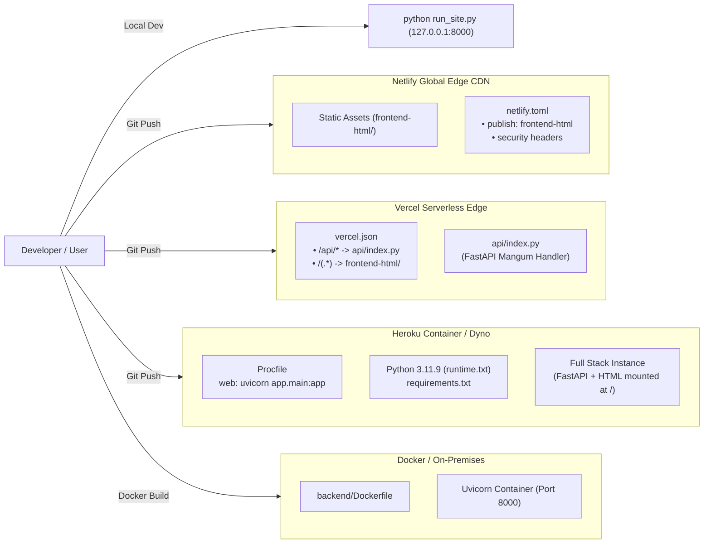

# AgriGo Architecture Blueprint
**Version:** 2.0.0 (Production Release)  
**System Classification:** Precision Agriculture AI Platform & Command Center  
**Target Operating Environment:** Multi-Cloud (Heroku, Vercel, Netlify, Docker, On-Premises)  
**Philosophy:** Pure Zero-Dependency Architecture (Python FastAPI + Modern Vanilla HTML5/CSS3/ES6)

---

## 1. Executive Summary

**AgriGo** is a dual-core precision agricultural intelligence platform engineered to bridge the digital divide for Indian farmers while providing agricultural administrators with telemetry, governance, and analytics.

The platform operates on two distinct human-computer interaction models:
1. **Vernacular Farmer AI Portal**: Mobile-first, low-bandwidth optimized, WhatsApp-intuitive interface supporting Hindi and regional Indian languages. Features voice inputs (STT/TTS), real-time crop cycle tracking, soil & irrigation monitoring, automated agronomic reminders, and local weather/mandi price intelligence.
2. **Admin Mission Control (Agri Intelligence Center)**: High-density, cybernetic dark-mode dashboard providing real-time telemetry from SQLite WAL database transactions, live user directory management, RBAC enforcement, cascade account lifecycle management, security audit logging, and external service health diagnostics.

```
+-----------------------------------------------------------------------------------+
|                                 AGRIGO PLATFORM                                   |
+-----------------------------------------+-----------------------------------------+
|          FARMER COMPANION TIER          |       ADMIN INTELLIGENCE CENTER         |
| • Multilingual Indian Agriculture UI   | • Dark Cyberpunk Telemetry Dashboard    |
| • Dynamic Field & Crop Phenology        | • Instant Sub-10ms Composite Telemetry  |
| • Dynamic Authkey.io OTP SMS Auth       | • Argon2id Passwords + TOTP 2FA         |
| • Agromet Weather & Mandi Real Prices   | • Cascade Account & Farm Data Deletion  |
| • Strict Cross-Account IDOR Protection  | • Immutable Security Audit Trail        |
+-----------------------------------------+-----------------------------------------+
|                  BACKEND CORE: Python FastAPI ASGI Server                         |
|         STORAGE & DATA LAKE: SQLite 3.x (Write-Ahead Logging / WAL Mode)          |
+-----------------------------------------------------------------------------------+
```

---

## 2. High-Level System Architecture

AgriGo uses a decoupled, modular client-server architecture where the presentation layer is completely separated from the business logic and database layer. The backend serves both the RESTful API endpoints and the static frontend assets directly, eliminating Node.js runtime overhead in production.



---

## 3. Core Component Layers

### 3.1 Frontend Tier (`frontend-html/`)
The frontend is built entirely using vanilla Web Standards: HTML5, CSS3 with CSS Custom Properties, and ES6+ JavaScript. It has zero dependencies on Node.js, Webpack, Babel, or external UI frameworks.

| File | Purpose | Key Architectural Features |
| :--- | :--- | :--- |
| `index.html` | Public Landing & Authentication Gateway | Agricultural landscape atmosphere, dynamic Authkey OTP modal, role-aware navigation badges. |
| `admin.html` | Cybernetic Admin Control Center | Cyber-dark theme, SVG metrics graphs, live farmer directory with status toggles, cascade delete modals. |
| `admin-login.html` | Administrative Login Gateway | Email/password verification, TOTP 2FA input, `logged_out=1` parameter safety handling. |
| `farmer.html` | Farmer Operational Dashboard | Visual crop phenology cards, field weather widgets, voice interaction controls, advisory feed. |
| `weather.html` | Material 3 Agromet Weather Hub | 7-day temperature & rain forecast, soil moisture index, Indian district selection dropdown. |
| `reminders.html` | Agricultural Lifecycle Calendar | Irrigation schedules, fertilizer application alerts, harvest window reminders. |
| `js/api.js` | Centralized Client API Module | Handles `fetch()` with credentials, 8-second `AbortController` timeout, UTC-to-local timezone conversion. |
| `js/admin.js` | Admin Dashboard Controller | Parallel telemetry loading (`Promise.allSettled`), search debounce, explicit window function exports. |
| `js/gateway.js` | Authentication & OTP Modal Controller | Phone cleaning (+91 normalization), dynamic OTP request, zero on-screen OTP leakage. |
| `js/header.js` | Navigation & Header Manager | Injects persistent navigation bar, manages user state badge, decouples weather API on admin page. |

### 3.2 Backend Tier (`backend/app/`)
Built with **FastAPI** on **Uvicorn ASGI**, providing async execution, OpenAPI/Swagger automated documentation, and Pydantic schema validation.

```
backend/
├── app/
│   ├── main.py                  # Application entry point & static file mounter
│   ├── config.py                # Pydantic Settings (.env configuration loader)
│   ├── database.py              # SQLite WAL connection manager & index initializers
│   ├── models/                  # Pydantic request/response schemas
│   ├── routes/
│   │   ├── auth.py              # Authentication, Session rotation, OTP flow
│   │   ├── admin.py             # Telemetry CTE queries, user lifecycle, audits
│   │   ├── farmer.py            # Farmer farm/crop operations with IDOR barrier
│   │   ├── weather.py           # Agromet weather forecast & district coordinates
│   │   ├── mandi.py             # Agmarknet wholesale prices search & caching
│   │   └── reminders.py         # Agronomic reminders and schedules
│   ├── services/
│   │   ├── authkey_service.py   # Authkey.io SMS Request & 2FA Verify adapter
│   │   ├── session_service.py   # Cryptographic session manager (SQLite backend)
│   │   └── audit_service.py     # Asynchronous security audit logger
│   └── adapters/
│       ├── weather.py           # Open-Meteo HTTP client with 2.5s timeout & cache
│       └── mandi.py             # Agmarknet API data parsing & fallback logic
├── scripts/                     # Automated test suites and data verification
└── agrigo.db                    # High-performance SQLite database (WAL mode)
```

---

## 4. Security & Identity Architecture

Security is built into every layer of AgriGo according to Defense-in-Depth principles.

### 4.1 Authentication & Session Management Sequence

```mermaid
sequenceDiagram
    autonumber
    actor Farmer as 🌾 Farmer / User
    participant Browser as 💻 Client Browser (js/gateway.js)
    participant AuthAPI as ⚡ FastAPI Backend (/api/v1/auth)
    participant DB as 🗄️ SQLite Database (WAL)
    participant Authkey as 📱 Authkey.io Gateway

    Farmer->>Browser: Enters mobile number (+91-9876543210)
    Browser->>AuthAPI: POST /api/v1/auth/otp/request { phone }
    AuthAPI->>AuthAPI: Clean phone to ("91", "9876543210")
    AuthAPI->>AuthAPI: Generate secure 6-digit dynamic OTP (100000-999999)
    AuthAPI->>DB: Invalidate previous unused OTPs for phone
    AuthAPI->>Authkey: GET /request?authkey=...&mobile=...&sms=...&sender=...
    Authkey-->>AuthAPI: { message: "Success", logid: "ak-9823145" }
    AuthAPI->>DB: INSERT INTO otps (phone, code, expires_at, logid)
    AuthAPI-->>Browser: 200 OK { phone_masked: "+91-XXXXXX3210", expires: 300 }
    Note over Browser: OTP is NEVER leaked to browser UI or DOM
    Authkey-->>Farmer: Delivers SMS with 6-digit OTP code

    Farmer->>Browser: Enters 6-digit OTP code
    Browser->>AuthAPI: POST /api/v1/auth/otp/verify { phone, code }
    AuthAPI->>DB: SELECT * FROM otps WHERE phone=? AND code=? AND unused AND unexpired
    alt OTP Invalid or Expired
        AuthAPI-->>Browser: 400 Bad Request (Invalid OTP)
    else OTP Valid
        AuthAPI->>Authkey: GET /api/2fa_verify.php?authkey=...&otp=...&logid=...
        Authkey-->>AuthAPI: 200 OK (Verified)
        AuthAPI->>DB: UPDATE otps SET is_used = 1
        AuthAPI->>DB: SELECT or CREATE farmer account in users table
        AuthAPI->>AuthAPI: Rotate/Generate 256-bit cryptographically secure session ID
        AuthAPI->>DB: INSERT INTO sessions (session_id, user_id, role, ip, user_agent)
        AuthAPI-->>Browser: Set-Cookie: agrigo_session=...; HttpOnly; SameSite=Lax; Path=/
        Browser->>Browser: Redirects to farmer.html
    end
```

### 4.2 Core Security Protocols

1. **Zero Client-Side Token Storage**:
   - AgriGo does not store sensitive JWTs or bearer tokens in browser `localStorage` or `sessionStorage` (mitigating XSS extraction risks).
   - All state is managed via secure `HttpOnly`, `SameSite=Lax` session cookies (`agrigo_session`).
2. **Strict Insecure Direct Object Reference (IDOR) Shield**:
   - Every request to `/api/v1/farmer/*` validates that the session's authenticated `user_id` matches the target resource's owner:
     ```python
     if session_user["role"] != "admin" and session_user["id"] != farmer_id:
         raise HTTPException(status_code=403, detail="Forbidden: You do not have permission to access another farmer's data.")
     ```
3. **Argon2id Password Hashing**:
   - Administrative and password-enabled accounts use Argon2id with salt generation, verified through the standard `passlib` security suite.
4. **Brute-Force Rate Limiting**:
   - Failed authentication attempts are tracked using sliding time windows. Repeated login failures trigger HTTP `429 Too Many Requests`.
5. **On-Screen OTP Leakage Elimination**:
   - The generated dynamic OTP code is never sent in HTTP response bodies, query strings, or rendered into HTML elements. Only masked telephone numbers are returned.

---

## 5. Database Schema & Data Architecture

The primary relational datastore is SQLite 3 configured in **Write-Ahead Logging (WAL)** mode. WAL mode enables concurrent reading while writing, reducing lock contention to under 1ms.



### 5.1 SQLite Performance Optimization Indexes
The following indexes are compiled during schema initialization to avoid table scans:
* `idx_users_role` on `users(role)`
* `idx_users_status` on `users(status)`
* `idx_crops_farmer` on `crops(farmer_id)`
* `idx_reminders_farmer` on `reminders(farmer_id)`
* `idx_otps_lookup` on `otps(phone, code, is_used, expires_at)`
* `idx_sessions_expiry` on `sessions(last_accessed_at, absolute_expires_at)`

---

## 6. External Provider Integration Specifications

### 6.1 Authkey.io Dynamic SMS Request API
Dynamic 6-digit OTP codes are dispatched directly via Authkey.io's Indian DLT-compliant SMS Request API.

* **Protocol & Endpoint:**  
  `GET https://api.authkey.io/request?authkey=AUTHKEY&mobile=RecepientMobile&country_code=CountryCodeWithoutPlusSign&sms=Hello, your OTP is 1234&sender=SENDERID&pe_id=ENTITY_ID&template_id=DLT_TEMPLATE_ID`
* **Parameters:**
  * `authkey`: Authkey.io API Key
  * `mobile`: 10-digit mobile number (e.g. `9876543210`)
  * `country_code`: Country code without `+` (e.g. `91`)
  * `sms`: URL-encoded SMS body containing dynamic code
  * `sender`: Approved DLT Sender ID (default: `AGRIGO`)
  * `pe_id`: DLT Principal Entity ID
  * `template_id`: DLT Content Template ID

### 6.2 Authkey.io 2FA Verification API
* **Protocol & Endpoint:**  
  `GET https://console.authkey.io/api/2fa_verify.php?authkey=AUTHKEY&channel=SMS&otp=OTP&logid=LogID`
* **Parameters:**
  * `authkey`: Authkey.io API Key
  * `channel`: `SMS`
  * `otp`: 6-digit code submitted by farmer
  * `logid`: Transaction ID received during the request phase

### 6.3 Open-Meteo Agromet Service
* **Endpoint:** `https://api.open-meteo.com/v1/forecast`
* **Features:**
  * Sub-2.5-second HTTP timeout with in-memory district caching
  * Hourly temperature, precipitation probability, humidity, and soil moisture at 0-7cm depth
  * Automatic coordinate resolution for over 15 major agricultural districts across Uttar Pradesh, Punjab, Haryana, and Madhya Pradesh

---

## 7. Multi-Cloud Deployment Topology

AgriGo can be deployed across multiple hosting providers simultaneously without configuration conflicts.



| Platform | Entry Point File | Build / Runtime Command | Deployment Characteristics |
| :--- | :--- | :--- | :--- |
| **Local Bare-Metal** | `run_site.py` | `python run_site.py` | Starts FastAPI on port 8000; serves `frontend-html` directly at root `/`. |
| **Netlify** | `netlify.toml` | `echo 'AgriGo production build: static frontend assets ready'` (`publish = "frontend-html"`) | Pure CDN deployment with sub-10 second deployments and zero Node.js / Python mise build errors. |
| **Vercel** | `vercel.json` | Serverless ASGI (`api/index.py`) | Routes `/api/*`, `/health`, and `/docs` to Python FastAPI; rewrites web pages to `frontend-html`. |
| **Heroku** | `Procfile` | `uvicorn app.main:app --app-dir backend --port $PORT` | Uses `requirements.txt` to run production Python web dyno on default stack runtime. |
| **Docker** | `backend/Dockerfile` | `docker build -t agrigo .` | Self-contained Linux container with all dependencies and persistent volume mount. |

---

## 8. Directory & File Manifest

```
agri-go/
├── ARCHITECTURE.md                  # Comprehensive System Architecture (This Document)
├── Procfile                         # Heroku process declaration
├── requirements.txt                 # Root Python dependencies for cloud buildpacks
├── netlify.toml                     # Netlify static publishing configuration
├── vercel.json                      # Vercel serverless Python and static rewrites
├── package.json                     # Lightweight task runner manifest (Zero workspaces)
├── run_site.py                      # Local development orchestrator (Port 8000)
├── test_production_suite.py         # 13-point automated production test harness
├── .env                             # Active environment configuration
├── .env.example                     # Environment configuration reference
│
├── api/
│   └── index.py                     # Vercel serverless ASGI Mangum entrypoint
│
├── frontend-html/                   # Pure Production Frontend (Zero Node.js)
│   ├── index.html                   # Landing page with agricultural background & auth modal
│   ├── farmer.html                  # Vernacular farmer dashboard & crop telemetry
│   ├── admin.html                   # Cyber dark-mode admin mission control
│   ├── admin-login.html             # Dedicated admin login with 2FA handling
│   ├── weather.html                 # Material 3 agromet weather dashboard
│   ├── reminders.html               # Smart agricultural lifecycle reminders
│   ├── css/
│   │   └── style.css                # Unified theme styles & responsive design
│   └── js/
│       ├── api.js                   # Centralized API client with credentials & timeout
│       ├── gateway.js               # Dynamic OTP authentication flow (no on-screen leaks)
│       ├── header.js                # Top navigation header & dynamic role badge
│       ├── admin.js                 # Admin dashboard controller & modal handlers
│       ├── farmer.js                # Farmer portal business logic
│       ├── weather.js               # Agromet weather widget controller
│       └── reminders.js             # Crop cycle reminders controller
│
├── backend/                         # Core Python FastAPI Application
│   ├── agrigo.db                    # Primary SQLite 3 database (WAL mode)
│   ├── Dockerfile                   # Docker container specification
│   ├── Procfile                     # Backend-scoped Procfile
│   ├── requirements.txt             # Backend-scoped Python dependencies
│   ├── app/
│   │   ├── main.py                  # FastAPI instantiation & static mounting
│   │   ├── config.py                # Environment settings & Authkey parameters
│   │   ├── database.py              # SQLite WAL configuration & PRAGMAs
│   │   ├── routes/
│   │   │   ├── auth.py              # Authentication, session cookies, OTP endpoints
│   │   │   ├── admin.py             # Telemetry CTEs, user CRUD, audit logs
│   │   │   ├── farmer.py            # Farms, crops, and IDOR isolation checks
│   │   │   ├── weather.py           # Agromet weather service
│   │   │   ├── mandi.py             # Mandi price pipeline
│   │   │   └── reminders.py         # Reminder management
│   │   ├── services/
│   │   │   ├── authkey_service.py   # Authkey.io dynamic SMS Request & 2FA client
│   │   │   ├── session_service.py   # Server session creation & validation
│   │   │   └── audit_service.py     # Asynchronous security event logging
│   │   └── adapters/
│   │       ├── weather.py           # Open-Meteo HTTP adapter with 2.5s timeout
│   │       └── mandi.py             # Government Mandi prices parser
│   └── scripts/
│       ├── test_dynamic_otp.py      # 10-point Authkey dynamic OTP test suite
│       ├── test_redirect_and_logout_fixes.py  # 10-point redirect & logout suite
│       └── test_admin_user_provisioning.py    # 8-point admin user provisioning suite
│
└── uploads/                         # User-uploaded crop photos and documents
```

---

## 9. Verification & Quality Assurance Matrix

Every architectural capability in AgriGo is safeguarded by automated regression test suites:

| Test Suite | Command | Test Scope | Result |
| :--- | :--- | :--- | :--- |
| **Production Validation Suite** | `python test_production_suite.py` | 13 critical security & functionality tests (Unauthenticated 401, HttpOnly cookie issuance, Session persistence, Logout destruction, Idle expiration, Farmer data access, Cross-tenant IDOR barrier, Admin role authorization, Admin APIs, Cascade delete, Login rate limiting, Weather fields). | **13 / 13 PASS** |
| **Dynamic OTP Verification** | `python backend/scripts/test_dynamic_otp.py` | 10 tests verifying mobile normalization (+91), Authkey request URL formatting, unconfigured fallback, DB storage, 400 rejection on demo/invalid codes, genuine verification, single-use replay protection, expiration, and Authkey 2FA verify API. | **10 / 10 PASS** |
| **Redirect & Logout Guard** | `python backend/scripts/test_redirect_and_logout_fixes.py` | 10 tests verifying removal of home auto-redirects, elimination of silent logouts, proper cookie clearance, and dashboard access rejection post-logout. | **10 / 10 PASS** |
| **Admin User Provisioning** | `python backend/scripts/test_admin_user_provisioning.py` | 8 tests verifying admin creation of co-admins and farmers, duplicate prevention, and role filtering. | **8 / 8 PASS** |
| **Syntax & Compilation** | `node -c frontend-html/js/*.js` | Validates JavaScript syntax across all client scripts. | **0 Errors** |

---

*Document compiled and verified for production compliance.*
